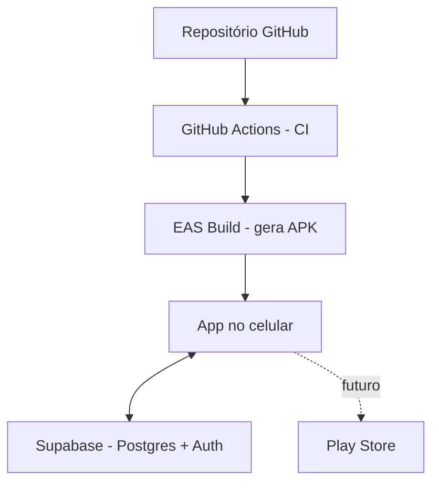

# Aularme 🐕⏰

**Alarme de cuidados para quem tem cachorro.**
"Au" (do latido) + "alarme" — porque seu cachorro não fala, mas o app avisa por ele.

> ⚠️ Projeto em desenvolvimento. Este README descreve o escopo definido antes da primeira linha de código — funciona como o "contrato" do projeto e vai sendo atualizado conforme o app evolui.

---

## Sobre o projeto

Quem tem cachorro sabe: entre o trabalho, a correria do dia e a vida adulta, é fácil esquecer um passeio, atrasar a comida ou deixar o banho pra depois. O Aularme existe pra isso: um app que dispara lembretes na hora certa pra cada cuidado do seu cachorro, e te ajuda a nunca perder o ritmo.

O app dispara alarmes nos horários certos pra cada tipo de cuidado. Você confirma que fez, e isso fica registrado no dia. Um painel mostra, de relance, como está o dia do seu cachorro — inspirado nos anéis de atividade de relógios inteligentes, só que sem precisar de nenhum hardware no pescoço do cachorro.

Esse é também um projeto de aprendizado: cada parte do código é comentada explicando o porquê das decisões, não só o "como". A ideia é que qualquer pessoa lendo o repositório entenda o raciocínio por trás de cada escolha técnica — e que sirva como peça de portfólio real, não só um tutorial copiado.

## Funcionalidades (v1)

- **Cadastro de pets**: cadastre quantos cachorros quiser, com nome, foto e data de nascimento (opcional — usada pra calcular a idade e, futuramente, sugerir cuidados por fase de vida). (Só cachorros por enquanto — outras espécies podem entrar depois.)
- **5 tipos de cuidado**: passeio, comida, ração, brincar e banho.
- **Dois tipos de lembrete**:
  - *Fixo diário* — cuidados que se repetem todo dia (comida, passeio), com horário sugerido e editável.
  - *Avulso* — cuidados pontuais (banho, veterinário), marcados pra um dia específico.
- **Alarme + confirmação**: o app avisa na hora certa; você toca em "feito" e a atividade fica registrada no dia.
- **Anéis de cuidado**: painel visual mostrando quantos cuidados já foram cumpridos hoje, por pet — de relance dá pra ver se falta alguma coisa.
- **Mascote reativo**: o avatar do cachorro reage ao dia — mais feliz quando os cuidados estão em dia, "carente" quando ficam pendentes. Serve como empurrãozinho pra quem esquece.

## Segurança

- **Autenticação**: Supabase Auth, com tokens guardados em `expo-secure-store` (armazenamento criptografado do sistema) em vez de `AsyncStorage`, que não é seguro pra dados sensíveis.
- **RLS (Row Level Security)**: cada usuário só enxerga e edita os próprios pets e registros — a regra fica no banco, não só no código do app.
- **Segredos fora do repositório**: chaves do Supabase ficam em `.env`, nunca commitadas (o `.gitignore` já cobre isso desde o início).
- **Fotos privadas**: fotos dos pets ficam num bucket privado do Supabase Storage, acessível só pelo dono autenticado — não público.

## Acessibilidade e responsividade

Este não é um item "bônus" — é requisito desde o design das primeiras telas. Um app de lembrete de cuidados é especialmente útil pra pessoas cegas ou neurodivergentes, então ele precisa funcionar bem com leitor de tela e ser previsível.

- **Leitor de tela (VoiceOver / TalkBack)**: todo elemento interativo leva `accessibilityLabel` e `accessibilityRole` descritivos, não só ícone sem contexto.
- **Alternativa em texto pros anéis**: o painel visual de anéis tem uma versão equivalente em texto (ex: "3 de 5 cuidados feitos hoje") — um indicador só visual exclui quem usa leitor de tela.
- **Respeita configurações do sistema**: tamanho de fonte dinâmico e "reduzir movimento" — o mascote e os anéis nunca dependem de animação pra fazer sentido.
- **Contraste WCAG AA** (mínimo 4,5:1) em todos os estados de cor, incluindo os anéis abertos/fechados.
- **Linguagem literal e direta** nas notificações e nos textos — evita ambiguidade e duplo sentido, o que ajuda tanto usuários autistas quanto qualquer pessoa lendo rápido.
- **Alarme configurável**: som, vibração ou silencioso — sensibilidade sensorial varia muito de pessoa pra pessoa.
- **Layout responsivo**: Flexbox do React Native em vez de posições fixas, testado em diferentes tamanhos de tela.

## Stack técnica

| Camada | Tecnologia | Por quê |
|---|---|---|
| App mobile | React Native + Expo | multiplataforma (Android/iOS com uma base só), build gerenciado via EAS sem precisar configurar Android Studio/Xcode do zero |
| Linguagem | TypeScript | tipagem estática ajuda a pegar erro antes de rodar, essencial num projeto sem testes automatizados ainda |
| Banco de dados | Supabase (PostgreSQL) | Postgres gerenciado com tier gratuito, autenticação pronta, e treino direto de SQL |
| Notificações | expo-notifications | notificações locais agendadas no próprio celular, sem precisar de servidor de push |
| CI | GitHub Actions | roda lint e testes a cada push, tier gratuito pra repositórios públicos |
| Build | EAS Build | gera o instalável (APK) sem precisar de máquina local configurada pra Android/iOS |
| Distribuição | GitHub Releases (APK direto) | grátis, sem depender da taxa de registro da Play Store enquanto o projeto está em fase de aprendizado |

## Arquitetura



## Como rodar localmente

> Seção será preenchida assim que a base do projeto for criada com `npx create-expo-app`.

```bash
# clonar o repositório
git clone https://github.com/pirespero/aularme.git
cd aularme

# instalar dependências
npm install

# configurar variáveis de ambiente do Supabase
cp .env.example .env

# rodar o app (abre o Expo Go / emulador)
npx expo start
```

## Estrutura do projeto (planejada)

```
aularme/
├── src/
│   └── app/              # telas (file-based routing do Expo Router)
├── components/           # componentes reutilizáveis (anéis, mascote, cards)
├── lib/
│   └── supabase.ts       # cliente Supabase configurado
├── hooks/                # lógica reutilizável (ex: useCuidadosDoDia)
├── types/                # tipos TypeScript compartilhados
├── supabase/
│   └── migrations/       # migrations do banco (SQL)
└── .github/
    └── workflows/        # pipeline de CI/CD
```

## Roadmap

- [x] Estrutura inicial do projeto (Expo + TypeScript)
- [x] Modelagem do banco no Supabase (pets, cuidados, registros diários)
- [ ] Autenticação (login/cadastro de usuário)
- [ ] Tela de cadastro de pet (com foto e data de nascimento)
- [ ] Landing page de apresentação (antes do login)
- [ ] Sistema de alarmes locais
- [ ] Painel de anéis de cuidado
- [ ] Mascote reativo
- [ ] Configurar RLS em todas as tabelas do Supabase
- [ ] Revisão de acessibilidade (leitor de tela, contraste, reduzir movimento)
- [ ] Testar responsividade em diferentes tamanhos de tela
- [ ] Pipeline de CI (lint + testes)
- [ ] Primeiro build via EAS + distribuição por APK
- [ ] Avaliar publicação na Play Store (taxa única de US$25)

## Ideias futuras (backlog)

Coisas que fazem sentido, mas que ficam fora do escopo por enquanto — documentadas aqui pra não esquecer, sem comprometer o que já está em andamento:

- **Sugestões automáticas de cuidado por porte + fase de vida**: ao cadastrar um pet, pré-sugerir os cuidados (tipo e frequência) com base no porte (pequeno/médio/grande) e na fase de vida calculada pela data de nascimento (filhote/adulto/idoso), em vez do usuário configurar tudo do zero. Sempre como sugestão de partida, nunca como recomendação veterinária definitiva — o usuário ajusta como quiser.
- **E-mails de autenticação personalizados**: trocar o HTML padrão dos e-mails do Supabase (confirmação de conta, recuperação de senha) por um template com a identidade visual do Aularme.
- **Fluxo de login mais robusto**: login com Google (mesmo padrão já usado no Receitrix), recuperação de senha ("esqueci minha senha"), validação de força de senha na tela antes de enviar, e mensagens de erro traduzidas/amigáveis em vez do texto cru que o Supabase devolve.

## Autor

**Rodolfo Pires**
Ex-chef de cozinha migrando pra desenvolvimento de software.
[LinkedIn](https://linkedin.com/in/rodolfo-pires) · [GitHub](https://github.com/pirespero)